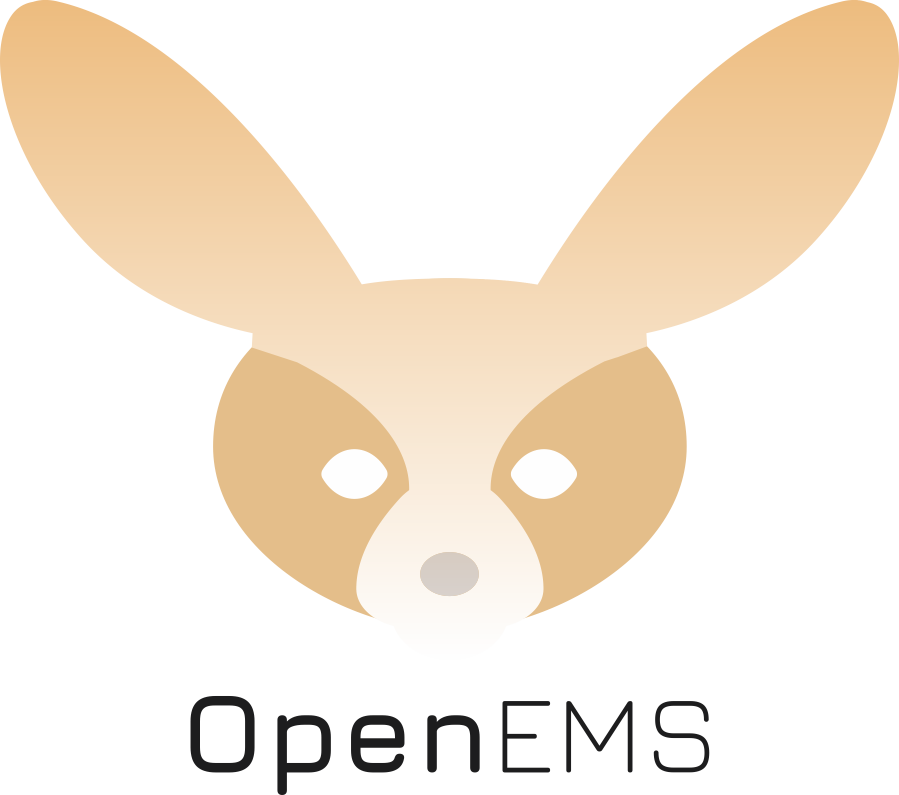
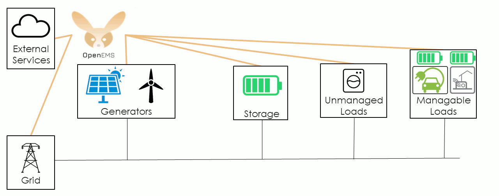
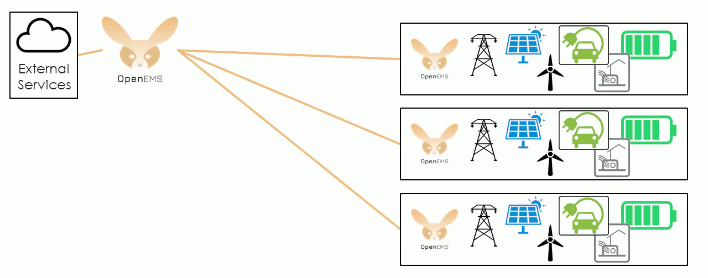
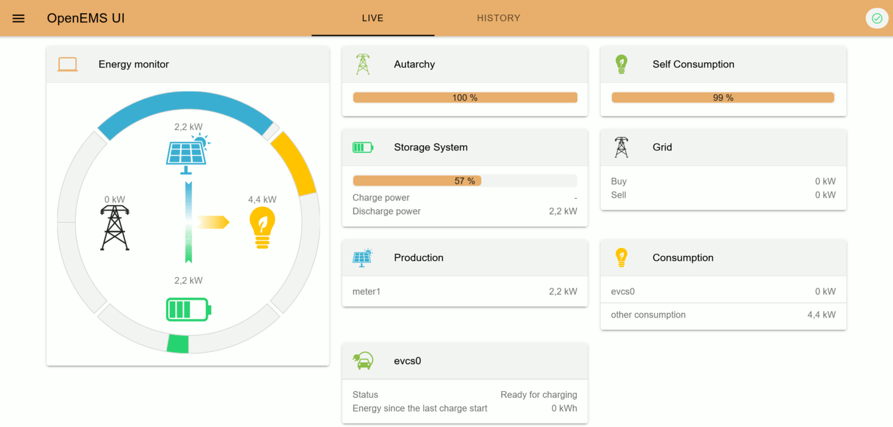
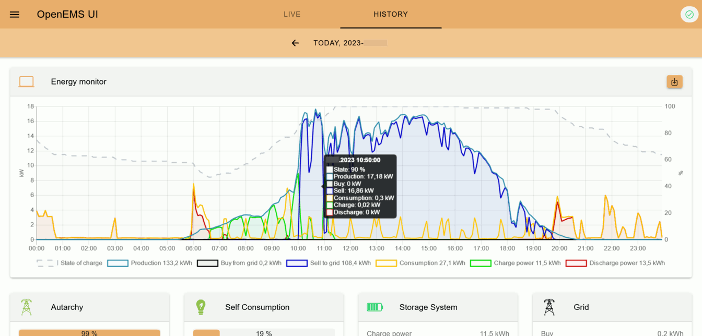
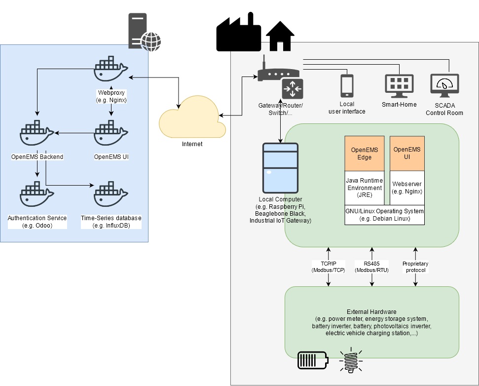

# open-ems — heat-pump fork (FH Salzburg)

Fork of [OpenEMS](https://github.com/OpenEMS/openems) for the heat-pump project. The upstream
state is unchanged; on top of it come **four in-house edge bundles** and a CI/Docker setup that
builds an edge image from them. The original project README starts below at "Open Source Energy
Management System".

This repository is part of the stack in [`stack-delpoy`](../stack-delpoy) (simulator, edge,
InfluxDB, Grafana).

## > What is specific to this fork

| Bundle | Factory PID | Role |
| ------ | ----------- | ---- |
| `io.openems.edge.heatpump.idm` | `HeatPump.Idm` | Device driver for the IDM Navigator 2.0 (air/water) over Modbus TCP. **667 channels**, generated from the manufacturer's parameter list. |
| `io.openems.edge.controller.heatpump.idm` | `Controller.Heatpump.Idm` | Control of the heat pump: manual, weather-compensated, PV-optimised or price-optimised. |
| `io.openems.edge.electrical.fronius` | `Electrical.Fronius` | Reads the power flow of a Fronius inverter through the Solar API. **Read-only**, supplies the controller with the PV surplus. |
| `io.openems.edge.price.service` | `Price.Service` | Fetches the current spot electricity price from the external `price-service` container. **Read-only**, supplies the controller with the price for the mode `PRICE_OPTIMIZED`. |

Also project-specific:

- `.gitlab-ci.yml` — **the only active CI.** It builds the edge image and nothing else, via
  `tools/docker/edge/Dockerfile` (Kaniko, tags `sha-…`, branch, `latest`). The
  `.github/workflows/` from upstream never run here (no GitHub remote).
- **Operation** — exclusively through the REST API (`:8084`) and the Felix web console
  (`:8080`).

## > io.openems.edge.heatpump.idm — the device driver

```
io.openems.edge.heatpump.idm/
├── generator/generate.py     # creates HeatpumpIdm.java + HeatpumpIdmImpl.java from the parameter list
├── src/…/HeatpumpIdm.java    # 667 channel IDs (Reg<address>), generated
├── src/…/HeatpumpIdmImpl.java# Modbus protocol (read/write tasks), generated
├── src/…/RegisterRange.java  # hand-written: range check of writable registers
└── src/…/Config.java         # modbus.id, modbusUnitId
```

**Generator.** `generator/generate.py` reads
`../heat-pump-simulator/sim/adress_lists/IDM_Navigator_Modbus_TCP_Parameterliste.json` as well as
the synthetic registers of the simulator (time lapse Reg9000, buffer layers Reg9010/9012,
coefficient of performance Reg9014) and
writes the channel and protocol definition from them. Simulator and driver therefore stay
consistent by construction. Run it after every change to the parameter list or to the synthetic
registers:

```bash
python io.openems.edge.heatpump.idm/generator/generate.py
```

The Gradle build does **not** invoke the generator — the generated files are checked in.

**Priorities.** The Modbus bridge works through all `HIGH` tasks per cycle, but only *one* `LOW`
task. With ~206 LOW tasks that means: `HIGH` every ~2 s, `LOW` every ~58 s. Which addresses are
`HIGH` is defined in `generate.py` as `HIGH_PRIORITY_ADDRS`. Every channel that should be finely
resolved in Grafana or read back quickly over REST belongs in there — afterwards run the
generator and rebuild the edge image.

**Value ranges.** `RegisterRange` checks minimum, maximum, type and register width from the
parameter list on write, before the value enters the Modbus write queue. Without that check an
oversized value would be silently truncated to 16 bit and the write task would then fail every
cycle. Rejected values report an error with a reason over the REST API instead of a silent
`200 {}`.

**Known limitation.** Three FLOAT registers (1392, 1441, 1483) return garbage because they
overlap in the manufacturer's specification. Deliberately left open — the manufacturer has no
solution.

## > io.openems.edge.controller.heatpump.idm — the control

Bundle documentation: [`io.openems.edge.controller.heatpump.idm/readme.adoc`](io.openems.edge.controller.heatpump.idm/readme.adoc)
— register table per mode, clamping rules and channels.

Four modes (`mode`):

| Mode | Value | Behaviour |
| ---- | ----- | --------- |
| `MANUAL` | 0 | Writes the configured setpoints through unchanged: Reg1710/1711 (heating/cooling request), Reg1449/1491 (flow setpoint). The heating curve is not touched. Reg1449 is only effective with circuit A operating mode "manual heating" (4). |
| `HEATING_CURVE` | 1 | Parameterises the weather-compensated heating curve (Reg1393 operating mode, Reg1429 slope, Reg1442 heating limit) and pins the room setpoint (Reg1401). |
| `PV_OPTIMIZED` | 2 | Like `HEATING_CURVE`, plus a PV surplus raises the room setpoint by `boostOffset`. |
| `PRICE_OPTIMIZED` | 3 | The heating curve stays active as in `HEATING_CURVE`; in addition the electricity price gates the heating request Reg1710. |

The numeric values rise in declaration order, each mode builds on the previous one. Careful with
old recordings: `HEATING_CURVE` and `PV_OPTIMIZED` swapped their values (1 and 2) on 2026-08-24,
so older `ActiveMode` points in InfluxDB/Grafana have to be read the other way round.

**PV logic.** The surplus is `-GRID_POWER` of the `Electrical.Fronius` component (the Solar API
reports `P_Grid` positive when drawing from the grid). Boosting starts above `surplusThreshold`
and only ends at `surplus < surplusThreshold - surplusHysteresis`; on top of that
`minBoostHoldTime` holds a reached state for at least a few minutes, so that cloud edges do not
cause cycling.

**Why the room setpoint and not the flow setpoint?** Acting on Reg1401 keeps the heating curve
active — the flow setpoint rises by roughly `(1 + slope) × boostOffset`. Setting Reg1449
directly would defeat the weather compensation (and is effective only in operating mode 4
anyway).

**Price logic.** `PRICE_OPTIMIZED` boosts nothing, it **blocks**: if the price of the
`Price.Service` component is above `priceThreshold`, Reg1710 (heating request) is set to 0, the
plant goes to standby and the buffer cools down. Heating is released at
`price ≤ priceThreshold` and blocked again only at `priceThreshold + priceHysteresis`; in between
`minPriceHoldTime` holds the state. **Fail-open:** without price data — no bundle referenced,
`enabled=false`, or no price point covering "now" — heating runs normally.

> **Diagnostic pitfall:** `HeatingAllowedByPrice = 1` does **not** prove that the price control
> is taking effect; with missing price data the very same 1 is there because of fail-open. Always
> cross-check `PriceNotAvailable = 0` **and** `CurrentPrice ≠ null`.

**Hysteresis and hold time are clamped to ≥ 0.** A negative hysteresis would swap the switching
points (the release threshold would sit below the blocking threshold) and make the release flip
every cycle. This concerns `priceHysteresis`, `minPriceHoldTime`, `surplusHysteresis` and
`minBoostHoldTime`. **Not** clamped are `priceThreshold` and `surplusThreshold` — negative spot
prices are real, "heat only at a negative price" is a legitimate setting.

**Reg1393 lives in an EEPROM** with a limited number of write cycles; that is why the controller
writes it only once per configuration change. When a new configuration is deployed, the default
`circuitMode = NORMAL (2)` overwrites a different value set at runtime.

Because the three curve registers are written only once per configuration change, a restart or a
manual change at the unit can leave the plant running permanently on parameters other than the
configured ones. Reading costs no EEPROM cycles, so every cycle compares target against actual
and reports a deviation via `HeatingCurveMismatch` — without writing back. Undefined registers
(readback after a restart) deliberately raise no alarm.

Channels:

| Channel | Meaning |
| ------- | ------- |
| `ActiveMode` | currently effective mode |
| `AppliedSetpoint` | last written flow setpoint (`MANUAL` only) |
| `AppliedRoomSetpoint` | last written room setpoint (curve modes) |
| `SurplusPower` | feed-in surplus in W (`PV_OPTIMIZED` only) |
| `Boosting` | PV boost active |
| `ElectricalNotAvailable` | WARNING: `PV_OPTIMIZED`, but no `GRID_POWER` available |
| `CurrentPrice` | price the decision is currently based on (EUR/kWh) |
| `HeatingAllowedByPrice` | release of the heating request by the price control |
| `PriceNotAvailable` | WARNING: `PRICE_OPTIMIZED`, but no price — fail-open active |
| `HeatingCurveMismatch` | WARNING: plant runs on curve parameters other than configured |

## > io.openems.edge.electrical.fronius — PV connection

Bundle documentation: [`io.openems.edge.electrical.fronius/readme.adoc`](io.openems.edge.electrical.fronius/readme.adoc)
— full channel and configuration table.

Polls `<baseUrl>/solar_api/v1/GetPowerFlowRealtimeData.fcgi` and maps
`P_Akku`/`P_Grid`/`P_Load`/`P_PV`/`SOC`/`Battery_Mode` onto channels; on communication or parse
errors the measurements are cleared (no stale values) and `CommunicationFailed` is set. Never
writes to the device. Ported from the Wattson project
(`io.openems.edge.device.externalapi`).

## > io.openems.edge.price.service — electricity price connection

Bundle documentation: [`io.openems.edge.price.service/readme.adoc`](io.openems.edge.price.service/readme.adoc)
— full channel and configuration table.

Polls `<baseUrl>/prices?provider=&zone=&start=&end=&timeframe=15min` of the external
`price-service` and publishes the price covering the current point in time as a channel.
Read-only. Config: `baseUrl`, `provider` (`awattar` / `entsoe`), `zone`, `pollIntervalMinutes`
(default 15). Channels: `CurrentPrice` (EUR/kWh), `CommunicationFailed`,
`NoPriceForCurrentTime`.

Not via `BridgeHttp` like the Fronius bundle, because its `subscribeJsonCycle` only handles
static URLs — the price URL needs `start`/`end` relative to "now". Instead it uses its own
`ScheduledExecutorService` + `OkHttpClient`, following the pattern of
`io.openems.edge.timeofusetariff.awattar`.

Two peculiarities, each of which cost a bug:

- **`start` is rounded down to the full hour.** The `price-service` includes an hour only if
  `start` ≤ its beginning. With a window starting at "now − 15 min", exactly the slot covering
  "now" was missing from minute 15 of every hour — the price control would have worked for only
  ~15 min per hour and would have run silently on fail-open the rest of the time.
- **Fetching and selecting are separate.** The fetched period is cached, a dedicated task picks
  the point for "now" **every minute** — otherwise the published price belongs to the slot of the
  last poll instead of to the present. Side effect: a failed poll no longer throws the points
  away, they carry their own validity and expire on their own. So with a dead `price-service` the
  controller keeps controlling until the lookahead (~2 h) is exhausted, and only then goes
  fail-open.

**The `price-service` is not part of this stack.** It lives in its own repository outside
`Warmpumpe` and runs in its own compose network; from the edge it is therefore **not** reachable
by service name, only via `http://host.docker.internal:8200`. If it is not running, the
controller silently falls back to fail-open — nothing reports it except `PriceNotAvailable`.

## > Building

**No JDK** is needed on the development machine — building happens in a container:

```bash
# edge image (also what the CI does)
docker build -f tools/docker/edge/Dockerfile -t open-ems:local .

# or from within the stack
docker compose up -d --build openems-edge       # in ../stack-delpoy
```

Testing a single bundle without a local JDK:

```bash
docker run --rm -v "$PWD":/src -w /src eclipse-temurin:21-alpine \
  ./gradlew --no-daemon :io.openems.edge.controller.heatpump.idm:test
```

The Dockerfile is deliberately written to be Kaniko-compatible (an explicit `COPY . /src` instead
of `RUN --mount=type=bind`), because the GitLab CI has no BuildKit.

After a CI build, `docker compose up -d` does **not** pull a new `:latest` by itself:

```bash
docker compose pull openems-edge && docker compose up -d --force-recreate openems-edge
```

## > Configuration and operation

Component instances do not live in the image but as Felix config files in the stack under
`stack-delpoy/data/openems-config/` (`modbus0`, `heatpump0`, `ctrlHeatpumpIdm0`, `fronius0`,
`price0`, `ctrlApiRest0`, `influx0`). They are created and changed through the Felix web console
`http://localhost:8080/system/console/configMgr`; that is also the only place showing which
factories the edge knows at all.

**A deployed bundle is not yet a running component.** If the instance is missing, an optional
reference (`electrical`, `price`) points nowhere without any error or even a single log line —
the controller silently keeps running fail-open. That is exactly what the price control failed on
at first. It can be checked over the REST API: an **empty** response to `/rest/channel/<id>/.*`
means the component does not exist.

Instances can also be created over JSON-RPC (`createComponentConfig`) — the `id` field of the
envelope has to be a **UUID**, otherwise the call is rejected with "is not a UUID member".

Channel access over REST (`http://localhost:8084`, `admin`/`admin`) — details and pitfalls are in
the README of [`stack-delpoy`](../stack-delpoy).
---

[](https://github.com/OpenEMS/openems/actions/workflows/build.yml)
[](https://gitpod.io/#https://github.com/OpenEMS/openems/tree/main)
[](https://doi.org/10.5281/zenodo.4440883)
[](https://codecov.io/gh/openems/openems)

<h1 align="center">
  </a>
  <br/>Open Source Energy Management System
</h1>

OpenEMS - the Open Source Energy Management System - is a modular platform for energy management applications. It was developed around the requirements of monitoring, controlling, and integrating energy storage together with renewable energy sources and complementary devices and services like electric vehicle charging stations, heat-pumps, electrolysers, time-of-use electricity tariffs and more.

If you plan to use OpenEMS for your own projects, please consider joining the [OpenEMS Association e.V.](https://openems.io/association), a network of universities, hardware manufacturers, software companies as well as commercial and private owners, and get in touch in the [OpenEMS Community forum](https://community.openems.io). 

### OpenEMS in »Local Energy Management«



### OpenEMS in »Areal Energy Management«



## OpenEMS IoT stack

The OpenEMS 'Internet of Things' stack contains three main components:

 * **OpenEMS Edge** runs on site, communicates with devices and services, collects data and executes control algorithms
 * **OpenEMS UI** is the real-time user interface for web browsers and smartphones
 * **OpenEMS Backend** runs on a (cloud) server, connects the decentralized Edge systems and provides aggregation, monitoring and control via internet

## Features

The OpenEMS software architecture was designed to leverage some features that are required by a modern and flexible Energy Management System:

 * Fast, PLC-like control of devices
 * Easily extendable due to the use of modern programming languages and modular architecture
 * Reusable, device independent control algorithms due to clear device abstraction
 * Wide range of supported devices and protocols

## OpenEMS UI Screenshots




## System architecture

OpenEMS is generally used in combination with external hardware and software components
(the exception is a simulated development environment - see [Getting Started](https://openems.github.io/openems.io/openems/latest/gettingstarted.html)). As a brief overview, this is how OpenEMS is used in production setups:


## Getting Started

* Open up a [Live-Demo on Gitpod](https://gitpod.io/#https://github.com/OpenEMS/openems)
* Follow the [Getting Started](https://openems.github.io/openems.io/openems/latest/gettingstarted.html) guide to setup OpenEMS on your own computer
* Please checkout our [contribution guidelines](/.github/CONTRIBUTING.md) before submitting code

## Documentation

* [Latest version of documentation](https://openems.github.io/openems.io/openems/latest/introduction.html)
* [Javadoc](https://openems.github.io/openems.io/javadoc/)

## Open Source philosophy

The OpenEMS project is driven by the [OpenEMS Association e.V.](https://openems.io/association), a network of users, vendors and scientific institutions from all kinds of areas like hardware manufacturers, software companies, grid operators and more. They share the common target of developing a free and open-source platform for energy management, that supports the 100 % energy transition.

We are inviting third parties to use OpenEMS for their own projects and are glad to support them with their first steps. In any case if you are interested in OpenEMS we would be glad to hear from you in the [OpenEMS Community forum](https://community.openems.io).

OpenEMS development was started by [FENECON GmbH](https://www.fenecon.de), a German company specialized in manufacturing and project development of energy storage systems. It is the software stack behind [FEMS - FENECON Energy Management System](https://fenecon.de/page/fems) and widely used in private, commercial and industrial applications.

OpenEMS is funded by several federal and EU funding projects. If you are a developer and you would like to get hired by one of the partner companies or universities for working on OpenEMS, please send your motivation letter to info@openems.io.

## Scientific Research

If you use OpenEMS in your scientific research, please use our Zenodo Digital Object Identifier (DOI) as reference:

[](https://doi.org/10.5281/zenodo.4440883)

## License

* OpenEMS Edge 
* OpenEMS Backend

Copyright (C) 2016-2025 OpenEMS Association e.V.

This product includes software developed at FENECON GmbH: you can
redistribute it and/or modify it under the terms of the [Eclipse Public License version 2.0](LICENSE-EPL-2.0). 

 * OpenEMS UI

Copyright (C) 2016-2025 OpenEMS Association e.V.

This product includes software developed at FENECON GmbH: you can
redistribute it and/or modify it under the terms of the [GNU Affero General Public License version 3](LICENSE-AGPL-3.0).
